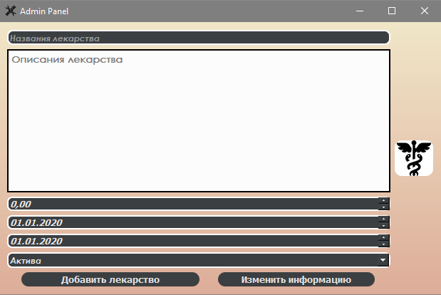
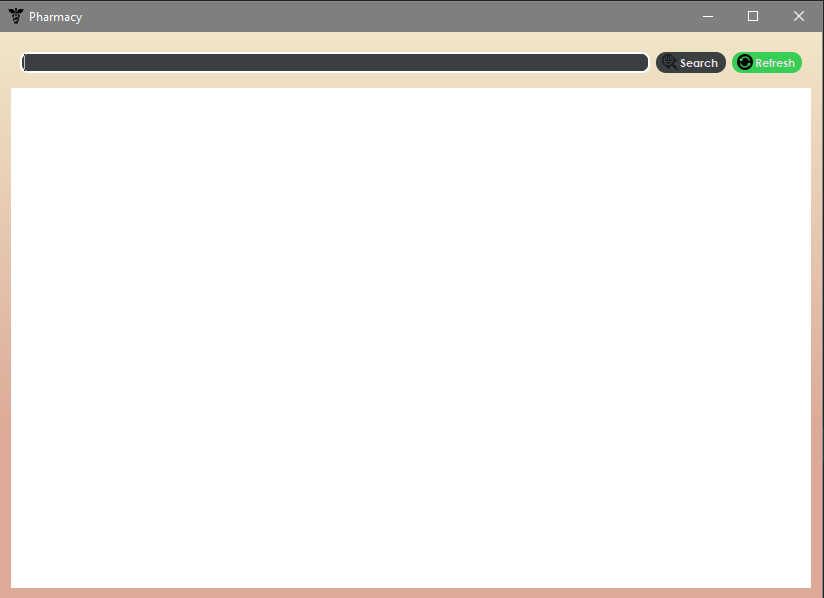
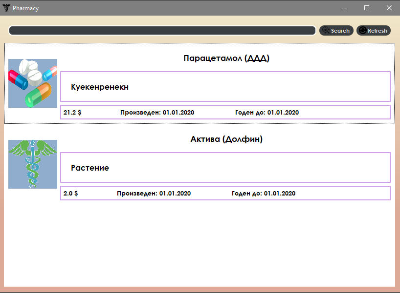

# course-work
Это простая реализация приложения с помощью библиотеки PyQt5.
Основной задачей которой является создания простого приложения с CRUD функциональностью.

С помощью админ панели вы можете добавлять, удалять, изменять информацию о лекарствах в 
вашей базе данных, при нажатии на правую иконку в окне вы перейдете на главное окно приложения в 
котором можете просматривать содержимое базы данных и при желании провести простой поиск нужного
вам лекарства

После добавления информации в базу данных, содержимое главного меню также измениться 
